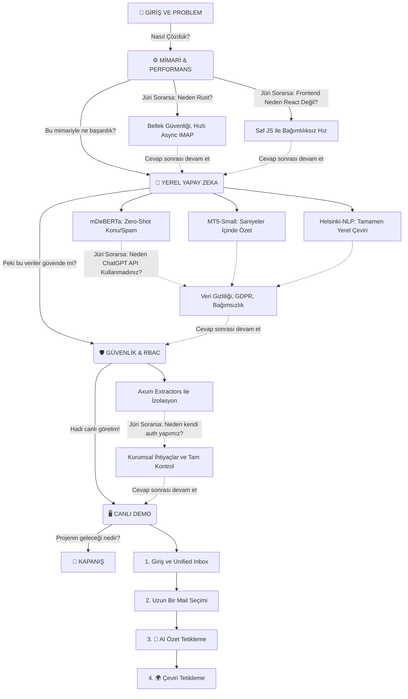

# 🗺️ Mailora Hub - Sunum Karar Ağacı ve Yol Haritası

> **Kullanım Amacı:** Sunum sırasında nerede olduğunuzu takip etmek ve jüriden gelebilecek ani sorulara karşı konuyu nereye bağlayacağınızı görmek için bu şemayı kullanın.

---

# 🚀 Mailora Hub - 20 Dakikalık Final Sunumu Şeması

| Bölüm | Süre | İçerik | Vurgulanacak Teknik Detay |
| :--- | :--- | :--- | :--- |
| **1. Giriş ve Problem Tanımı** | 3 Dk. | E-posta yönetimindeki mevcut sorunlar ve Mailora'nın vizyonu. | Bilgi yığını (Information Overload), Çoklu platform karmaşası. |
| **2. Mimari ve Teknoloji Seçimi** | 4 Dk. | Neden Rust, Vanilla JS ve SQLite kullanıldı? | Rust'ın borrow-checker yapısı, bellek güvenliği, Vanilla JS ile sıfır bağımlılık. |
| **3. Yerel Yapay Zeka Entegrasyonu** | 5 Dk. | API bağımsız, yerel çalışan NLP modelleri. Yaşanan sorunlar ve çözümleri. | Zero-shot classification (mDeBERTa), Helsinki-NLP (Çeviri), MT5-Small (Özetleme). |
| **4. Güvenlik ve RBAC Sistemi** | 3 Dk. | Rol tabanlı erişim kontrolü (Role-Based Access Control). | Axum extractors, Admin ve Üye izolasyonu. |
| **5. Canlı Demo (Live Showcase)** | 4 Dk. | Uygulamanın canlı kullanımı. | Unified Inbox (Birleştirilmiş Kutu), AI analiz hızı. |
| **6. Kapanış ve Soru-Cevap** | 1 Dk. | Gelecek vizyonu ve kapanış. | PIM (Kişisel Bilgi Yönetimi) hedefleri. |

---

# 🎤 Sunum Tam Anlatım Senaryosu

## 1. Giriş ve Projenin Amacı (0:00 - 3:00)
**"Değerli jüri üyeleri ve hocalarım, hoş geldiniz.** 
Bugün sizlere modern iletişimin en temel aracı olan e-postayı tamamen yeniden kurguladığımız, güvenlik ve yapay zekayı merkeze alan projemiz **Mailora**'ı sunacağım.

Günümüzde hepimiz hem iş hem de kişisel hayatımızda birden fazla e-posta hesabı kullanıyoruz. Araştırmalara göre, beyaz yakalı bir çalışan günde ortalama 2.5 saatini sadece gelen kutusunu düzenlemek, uzun mailleri okumak ve spamleri ayıklamakla geçiriyor. Mevcut e-posta istemcileri ise sadece mailleri listelemekle yetiniyor; 'anlamlandırma' aşamasında tamamen yetersiz kalıyorlar.

Biz Mailora Hub'ı tasarlarken kendimize şu soruyu sorduk: *'Gelen kutumuzdaki onca veriyi bizim yerimize okuyan, özetleyen ve bizi üçüncü parti API'lere mecbur bırakmadan bunu kendi bilgisayarımızda (lokal) güvenli bir şekilde yapan bir sistem nasıl olmalı?'* İşte projenin temel çıkış noktası bu oldu."

## 2. Mimari ve Teknoloji Seçimleri (3:00 - 7:00)
**"Mailora'yı tasarlarken geleneksel yaklaşımların dışına çıktık. Gelin biraz kaputun altına, mimariye bakalım.**

İlk kritik kararımız arka uçta (backend) **Rust** dilini kullanmak oldu. Neden Rust? Çünkü binlerce e-postanın IMAP protokolü üzerinden eşzamanlı ve asenkron (async) olarak senkronize edilmesi gerekiyordu. Rust'ın **borrow-checker** yapısı sayesinde klasik C/C++'ta karşılaşılan bellek sızıntısı (memory leak) ve thread yarış durumlarını (data race) derleme aşamasında tamamen yok ettik. Bu bize inanılmaz bir hız ve mutlak kararlılık sağladı.

Veritabanı olarak, sistemin dış bir sunucuya ihtiyaç duymadan 'kendi kendine yetebilen' (self-contained) bir yapıda olması için **SQLite** kullandık ve `sqlx` kütüphanesi ile asenkron bağlantı havuzları oluşturduk.

Ön yüz (frontend) tarafında ise React veya Vue gibi ağır framework'ler kullanmak yerine tamamen **Vanilla JS (Saf JavaScript)** ve modern CSS standartlarını tercih ettik. Böylece hiçbir dış bağımlılığa (dependency) ihtiyaç duymayan, sıfır gecikmeli, 'glassmorphism' tasarımlı ve anında yüklenen bir arayüz ortaya çıkardık."

## 3. Yerel Yapay Zeka (Local AI) Entegrasyonu (7:00 - 12:00)
*(Sunumun bu kısmı en kritik yerdir, teknik zorluklardan bahsederek jüriyi etkileyeceksiniz.)*

**"Gelelim projenin kalbi olan Yapay Zeka entegrasyonuna.** 
Başlangıçta dış API'ler (DeepL, OpenAI) kullanıyorduk. Ancak bu yaklaşım hem veri gizliliği açısından riskliydi hem de dış kaynaklı ağ engellemelerine takılıyordu. Bu yüzden tam bağımsızlık için modelleri **lokal (yerel)** olarak çalıştırma kararı aldık ve araya Python tabanlı, FastAPI ile çalışan bir mikro servis yazdık.

Bu süreçte ciddi performans darboğazlarıyla karşılaştık. Örneğin ilk başta HuggingFace üzerinden 2.2 GB boyutundaki `xlm-roberta-large` modelini kullanmayı denedik ancak CPU tarafında büyük yavaşlamalara sebep oldu. Hızla bir optimizasyon kararı alarak daha hafif ancak çok başarılı sonuçlar veren `mDeBERTa-v3-base` modeline geçiş yaptık. 

Şu anda sistemimizde mailler geldiği an:
1. **mDeBERTa** Zero-shot classification ile mailin konusunu ve spam oranını tahmin ediyor.
2. **MT5-Small** modeli uzun metinleri sadece 2-3 saniye içinde ana hatlarıyla özetliyor.
3. Çeviri modülünde ise tamamen yerel çalışan **Helsinki-NLP** modelleri ile diller arası anında çeviri yapıyoruz.

Yani kullanıcılarımız, verileri dışarıdaki bir bulut sunucusuna gönderilmeden, kendi cihazlarındaki işlem gücüyle, tamamen GDPR KVKK uyumlu şekilde bu yapay zeka araçlarını kullanabiliyor."

## 4. Güvenlik ve RBAC (Role-Based Access Control) (12:00 - 15:00)
**"Bir e-posta istemcisinin en önemli gereksinimi güvenliktir.**
Biz bu projede kurumsal kullanıma da uygun olabilmesi adına **RBAC (Rol Tabanlı Erişim Kontrolü)** yapısını sıfırdan tasarladık. 

Axum framework'ü üzerinde yazdığımız özel güvenlik filtreleri (extractors) sayesinde, sistemdeki kullanıcıları 'Admin' ve 'Üye' olarak katı bir şekilde ayırıyoruz. Örneğin bir kullanıcı `Unified Inbox` (Birleşik Gelen Kutusu) üzerinden mail çektiğinde, arka planda oluşturulan SQL sorguları dinamik olarak o kullanıcının sahip olduğu hesap ID'lerine göre kısıtlanıyor. Veritabanında her şey aynı tabloda dursa bile, hiçbir kullanıcının yetkisi olmayan bir posta kutusuna erişmesi veya API'yi manipüle etmesi mümkün değildir."

## 5. Canlı Demo (15:00 - 19:00)
*(Bu sırada uygulamayı açıp ekranda gösterin)*

**"Sözlerimi toparlarken, sistemin canlı çalışmasına birlikte bakalım.**
- *[Giriş Ekranı]* Gördüğünüz gibi saf JS ile hazırlanmış karanlık temalı login ekranımızdan 'Admin' (cunq) hesabımızla giriş yapıyoruz.
- *[Arayüz]* Arayüze girdiğimizde bizi sol tarafta gerçek veritabanımızdan çekilen 'Gmail Kişisel', 'İş' ve 'iCloud' gibi entegre ettiğimiz hesaplar karşılıyor. Tüm hesaplarımızı 'Tüm Hesaplar' (Unified Inbox) sekmesinden tek ekranda görebiliyoruz.
- *[Mail Seçimi]* Örneğin, burada uzun bir proje mailine veya bir iş başvurusu mailine tıklıyoruz.
- *[AI Özellikleri Gösterimi]* Sağ üstteki '🤖 AI Özet' butonuna tıkladığımızda, arka plandaki Python mikro servisimiz anında devreye giriyor. Mailin konusunu 'Proje/İş' olarak algılıyor, duygu durumunu çıkarıyor ve alt kısımda uzun mailin hızlıca okunabilecek çok kısa bir özetini bize sunuyor. 
- *[Çeviri Gösterimi]* '🌍 Çevir' özelliğine tıkladığımızda ise dış bağlantı olmadan yerel Helsinki-NLP modelimiz (veya DeepL API bağlantımız) metni bilgisayarın kendi içinde Türkçe/İngilizce arası anında çeviriyor."

## 6. Kapanış (19:00 - 20:00)
**"Sonuç olarak;**
Mailora Hub, Rust'ın sistem güvenliğini ve performansını, yerel yapay zeka modellerinin veri gizliliğini ve Vanilla JS'in esnekliğini tek potada eriten tam bağımsız bir platform oldu. Sadece bir okul projesi olmanın ötesinde, tam kapsamlı bir 'Kişisel Bilgi Yönetimi (PIM)' sistemine giden sağlam bir altyapı inşa ettik.

Bizi dinlediğiniz için teşekkür ederim, projenin kaynak kodları, mimari kararları veya kullandığımız modeller hakkında sorularınız varsa memnuniyetle yanıtlayabilirim."
